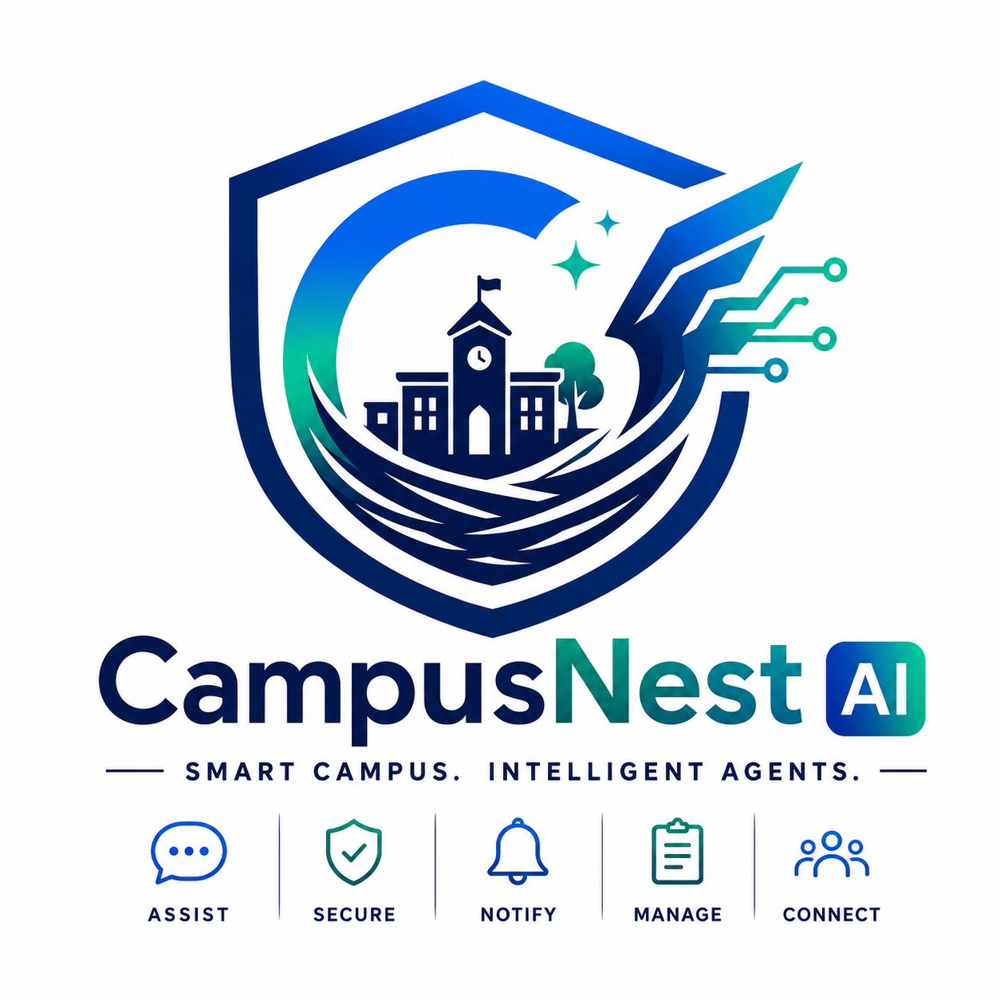
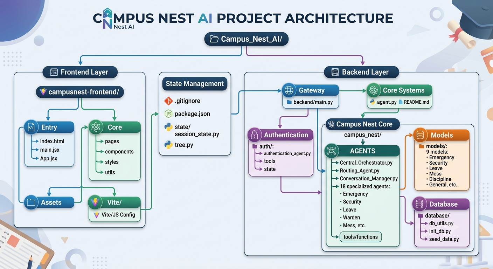
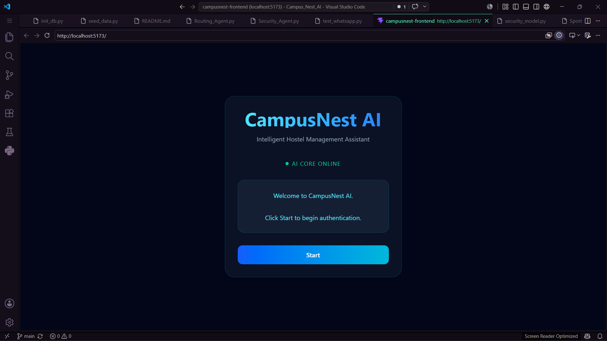
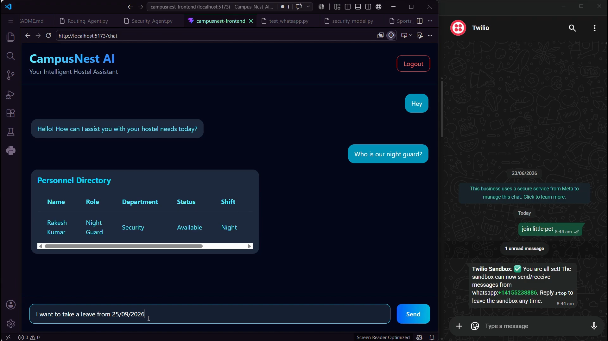
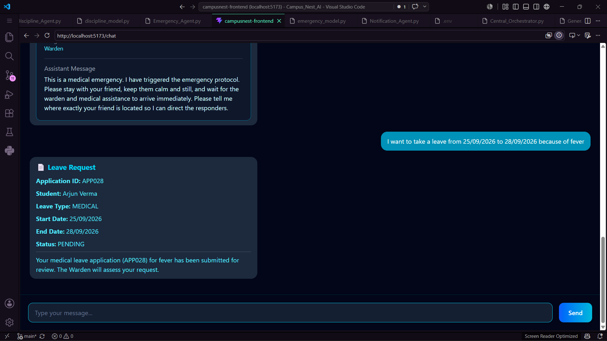
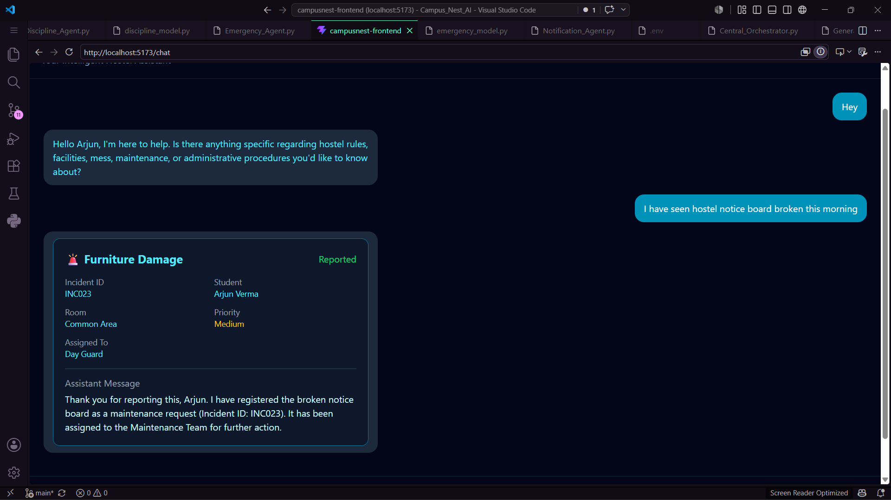
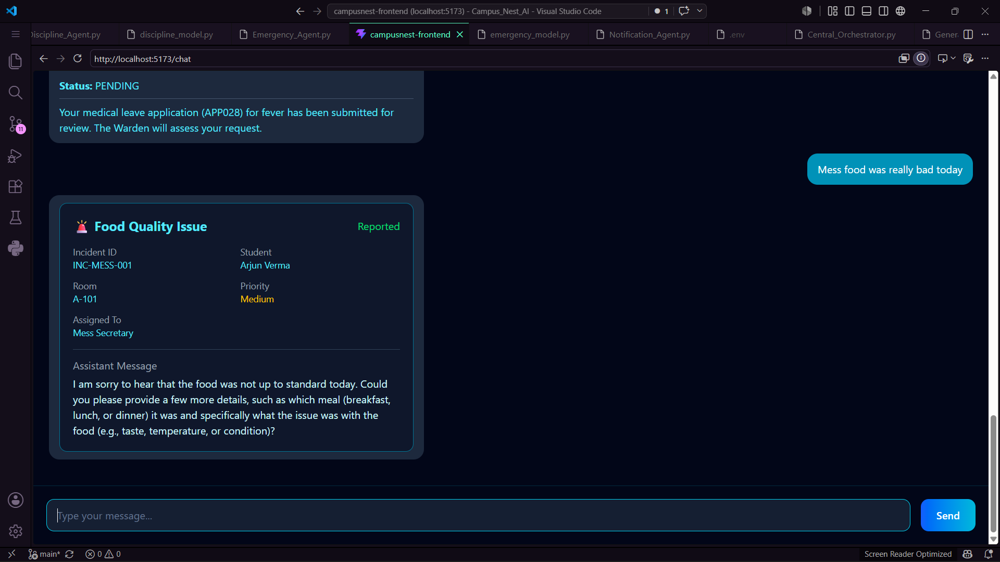
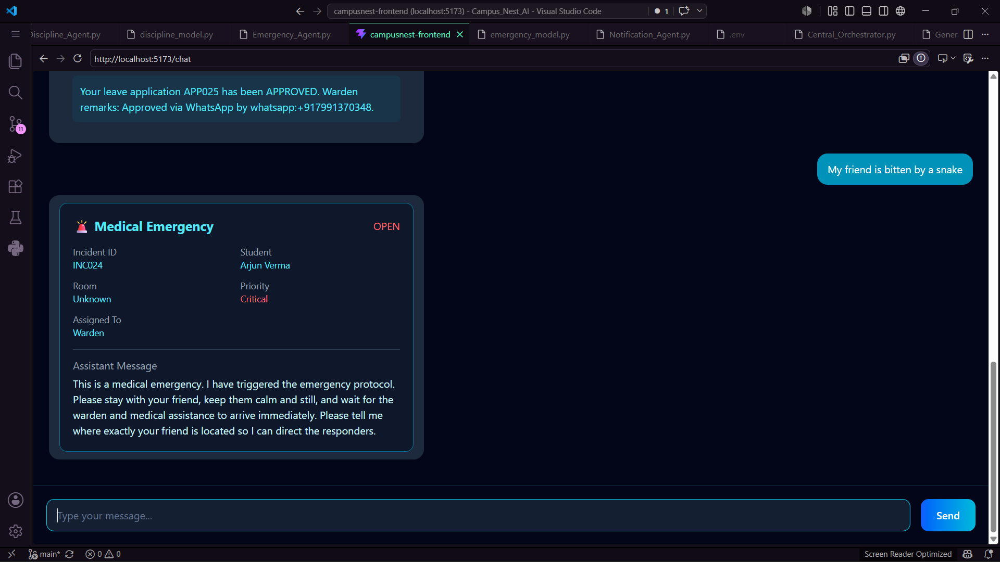
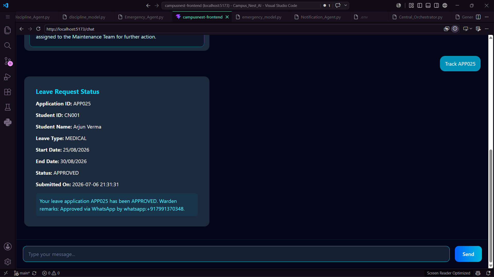

# 🏫 CampusNest AI



### *One Conversation. Every Campus Service.*

An AI-powered multi-agent platform that simplifies campus and hostel management through natural language interactions, intelligent workflow automation, and structured user experiences.

## 📖 Project Overview

CampusNest AI is an intelligent multi-agent platform designed to modernize campus and hostel management through Artificial Intelligence. Instead of navigating multiple portals, forms, and administrative offices, students interact with a single AI-powered assistant capable of understanding natural language and coordinating campus services behind the scenes.

The platform is built around a collaborative multi-agent architecture, where a Central Orchestrator analyzes each request and delegates it to specialized AI agents responsible for services such as leave management, maintenance, complaints, emergency support, security, notifications, sports, and student assistance. This modular approach enables the system to remain scalable, maintainable, and adaptable as new campus services are introduced.

Unlike traditional chatbots that return only conversational text, CampusNest AI generates structured responses using Pydantic schemas. These responses are dynamically rendered into reusable React components such as Leave Cards, Incident Cards, Tracking Cards, Finance Tables, and History Tables, creating an intuitive application-like experience for users.

By combining conversational AI, structured workflows, and modern software architecture, CampusNest AI demonstrates how artificial intelligence can simplify administrative processes, improve accessibility, and serve as a foundation for the next generation of smart educational institutions.

## ✨ Features

* 🤖 **Multi-Agent AI Architecture**
  Specialized AI agents collaborate through a Central Orchestrator to handle different campus services efficiently.

* 🔐 **Intelligent Student Authentication**
  Secure authentication workflow before accessing campus-specific services.

* 📝 **Leave Management**
  Submit, review, and track hostel leave requests through natural language conversations.

* 🛠️ **Maintenance Management**
  Report maintenance issues and receive structured tracking updates.

* 📢 **Complaint Registration & Tracking**
  Register complaints and monitor their status in real time.

* 🚨 **Emergency Assistance**
  Instantly access emergency support and important campus contacts.

* 🛡️ **Security & Discipline Support**
  Connect students with campus security and discipline-related services.

* 🍽️ **Mess & Hostel Services**
  Access hostel-related information and service support from a unified interface.

* 🏃 **Sports & Student Activities**
  Retrieve information about sports facilities and campus activities.

* 📊 **Structured AI Responses**
  AI-generated responses are rendered as interactive cards, tables, and tracking components instead of plain text.

* 💬 **Natural Language Interaction**
  Students communicate with the platform using everyday language without navigating multiple portals.

* ⚡ **Scalable & Modular Design**
  New AI agents and campus services can be added without changing the overall system architecture.

## 🏗️ System Architecture

CampusNest AI follows a modular **multi-agent architecture** that enables intelligent collaboration between specialized AI agents while providing users with a seamless conversational experience. Instead of relying on a single AI model to handle every request, the platform distributes responsibilities across domain-specific agents coordinated by a **Central Orchestrator**.

When a student submits a request through the React frontend, the request is securely forwarded to the FastAPI backend. The Central Orchestrator analyzes the user's intent, verifies authentication when required, and delegates the task to the most appropriate specialized AI agent. Each agent performs its designated responsibility, retrieves or processes the required information, and returns a structured response using Pydantic schemas.

Rather than displaying plain conversational text, these structured responses are dynamically rendered into reusable React UI components such as Leave Cards, Incident Cards, Tracking Cards, Finance Tables, and History Tables. This architecture combines the flexibility of conversational AI with the reliability and consistency of modern software applications.

The modular design also ensures that new campus services can be integrated by simply introducing additional AI agents without requiring significant architectural changes.

---

### 📊 High-Level Architecture



---


### 🧩 Architecture Components

| **Component**                 | **Responsibility**                                                                                                      |
|------------------------------|-------------------------------------------------------------------------------------------------------------------------|
| **React Frontend**           | Provides the conversational user interface and renders structured AI responses as reusable UI components.               |
| **FastAPI Backend**          | Acts as the communication bridge between the frontend and AI backend, managing API requests and responses.              |
| **Central Orchestrator**     | Interprets user intent, manages conversation flow, verifies authentication, and routes requests to specialized agents.  |
| **Authentication Agent**     | Handles secure student authentication, session management, and access control.                                          |
| **Specialized AI Agents**    | Execute domain-specific tasks including leave, maintenance, complaints, emergency, security, mess, sports, tracking, notifications, and general assistance.                                                                                                                   |
| **Pydantic Models**          | Define structured response schemas that enable predictable communication and dynamic frontend rendering.                |
| **SQLite Database**          | Stores application data, service requests, user information, and workflow-related records.                              |
| **Reusable React Components**| Transform structured AI responses into interactive cards, tables, tracking views, and other UI elements.                |

---

### ⚙️ Architecture Highlights

* 🤖 Multi-Agent AI Architecture
* 🎯 Intelligent Task Routing
* 🔐 Secure Authentication Workflow
* 💬 Natural Language Interaction
* 📊 Structured Pydantic Responses
* 🎨 Dynamic React UI Rendering
* 🔄 Modular & Scalable Design
* 🚀 Easy Integration of Future AI Agents

## 🛠️ Technology Stack

CampusNest AI combines modern web technologies with a scalable multi-agent AI architecture to deliver an intelligent and interactive campus management experience.

| **Category**                   | **Technology**               | **Purpose**                                                                         |
| ------------------------------ | ---------------------------- | ----------------------------------------------------------------------------------- |
| 🎨 **Frontend**                | React, Vite, Tailwind CSS    | Builds a fast, responsive, and dynamic user interface.                              |
| ⚙️ **Backend**                 | FastAPI, Python              | Handles API requests, business logic, and communication with AI agents.             |
| 🤖 **Artificial Intelligence** | Google ADK                   | Powers the multi-agent architecture, orchestration, and intelligent task execution. |
| 📋 **Data Validation**         | Pydantic                     | Generates structured response schemas for consistent frontend rendering.            |
| 🗄️ **Database**                | SQLite                       | Stores application data, user information, and campus service records.              |
| 🔐 **Authentication**          | Session-based Authentication | Provides secure student login and session management.                               |
| 🔄 **API Communication**       | REST APIs                    | Enables seamless communication between the frontend and backend.                    |
| 💻 **Development Tools**       | Git, GitHub, VS Code         | Supports version control, collaboration, and development workflow.                  |

### 🚀 Key Technologies

* **React** for building reusable and responsive UI components.
* **FastAPI** for high-performance backend API development.
* **Google ADK** for orchestrating collaborative AI agents.
* **Pydantic** for structured AI responses and schema validation.
* **SQLite** for lightweight and efficient data storage.
* **Git & GitHub** for version control and project collaboration.

## 📂 Project Structure

The project is organized into modular directories, separating the frontend, backend, AI agents, database utilities, authentication, and shared state management to ensure scalability and maintainability.

```text
CampusNest-AI/
│
├── auth/                          # Authentication system and session management
│
├── backend/                       # FastAPI backend
│   └── main.py
│
|__ assets
|
├── campus_nest/
│   ├── Campus_Nest_Core/
│   │   └── agents/                # Multi-agent AI architecture
│   │       ├── Central_Orchestrator.py
│   │       ├── Routing_Agent.py
│   │       ├── Authentication_Agent.py
│   │       ├── Leave_Agent.py
│   │       ├── Maintenance_Agent.py
│   │       ├── Complaint_Agent.py
│   │       ├── Emergency_Agent.py
│   │       ├── Security_Agent.py
│   │       ├── Mess_Agent.py
│   │       ├── Sports_Agent.py
│   │       ├── Notification_Agent.py
│   │       ├── Warden_Agent.py
│   │       ├── Track_Agent.py
│   │       ├── General_Agent.py
│   │       └── Report_Generator_Agent.py
│   │
│   ├── database/                  # Database initialization and utilities
│   └── models/                    # Pydantic response models
│
├── campusnest-frontend/           # React + Vite frontend
│   ├── src/
│   │   ├── components/            # Reusable UI components
│   │   ├── pages/                 # Application pages
│   │   ├── services/              # API communication
│   │   └── utils/
│
├── state/                         # Shared session state
│
├── agent.py                       # Main AI entry point
├── README.md
└── .gitignore
```

### 📌 Project Organization

* **Frontend** contains the complete React application and reusable UI components.
* **Backend** exposes FastAPI endpoints for frontend communication.
* **AI Core** contains the Central Orchestrator and specialized AI agents.
* **Database** manages initialization, utilities, and persistent storage.
* **Models** define structured Pydantic response schemas.
* **Authentication** handles secure login and session management.
* **State** stores shared session information across agents.

## 🚀 Installation

Follow the steps below to set up CampusNest AI on your local machine.

### 1️⃣ Clone the Repository

```bash
git clone https://github.com/aksingh291206-rgb/CampusNest-AI.git
cd CampusNest-AI
```

### 2️⃣ Create a Virtual Environment

**Windows**

```bash
python -m venv .venv
.venv\Scripts\activate
```

**Linux / macOS**

```bash
python3 -m venv .venv
source .venv/bin/activate
```

### 3️⃣ Install Python Dependencies

```bash
pip install -r requirements.txt
```

### 4️⃣ Install Frontend Dependencies

```bash
cd campusnest-frontend
npm install
cd ..
```

### 5️⃣ Configure Environment Variables

Create a `.env` file in the project root and add the required API keys and configuration values.

```env
GOOGLE_API_KEY=your_google_api_key
```

### 6️⃣ Initialize the Database (if required)

```bash
python campus_nest/database/init_db.py
python campus_nest/database/seed_data.py
```

Your development environment is now ready. Continue to the **Running the Project** section to start the backend and frontend services.

## ⚙️ Configuration

CampusNest AI uses environment variables to securely manage API keys and application configuration. Before running the project, create a `.env` file in the root directory.

### Example `.env`

```env
# Google AI API Key
GOOGLE_API_KEY=your_google_api_key

# Optional Configuration
ENVIRONMENT=development
DEBUG=True
```

> **Note:** Never commit your actual `.env` file or API keys to GitHub. The `.gitignore` file is already configured to exclude sensitive configuration files from version control.

### Configuration Checklist

* ✅ Create a `.env` file in the project root.
* ✅ Add your Google AI API key.
* ✅ Ensure `.env` is listed in `.gitignore`.
* ✅ Keep all secrets private and never share them publicly.

Once the environment variables are configured, you are ready to start both the backend and frontend services.

## ▶️ Running the Project

After completing the installation and configuration steps, start the backend and frontend services in separate terminals.

### 1️⃣ Start the Backend

Open a terminal in the project root, activate the virtual environment, and run:

```bash
.venv\Scripts\activate
python backend/main.py
```

The FastAPI backend will start and listen for requests from the frontend.

---

### 2️⃣ Start the Frontend

Open a second terminal and navigate to the frontend directory:

```bash
cd campusnest-frontend
npm run dev
```

The React development server will start and display a local URL similar to:

```text
http://localhost:5173
```

Open the URL in your browser to access the CampusNest AI interface.

---

### 3️⃣ Application Workflow

Once both services are running, the application follows this workflow:

```text
Student
   │
   ▼
React Frontend
   │
   ▼
FastAPI Backend
   │
   ▼
Central Orchestrator
   │
   ▼
Specialized AI Agent
   │
   ▼
SQLite Database (if required)
   │
   ▼
Structured Response
   │
   ▼
Reusable React Components
```

### ✅ You're Ready!

CampusNest AI is now running locally and ready to handle campus service requests through its intelligent multi-agent architecture.

## 💬 Example Workflow

The following example illustrates how CampusNest AI processes a typical student request using its multi-agent architecture.

### Example: Hostel Leave Request

**Student:**
*"I want to apply for leave from 12th July to 15th July because I am going home."*

**Workflow:**

```text
Student
    │
    ▼
React Frontend
    │
    ▼
FastAPI Backend
    │
    ▼
Central Orchestrator
    │
    ▼
Authentication Check
    │
    ▼
Leave Agent
    │
    ▼
Validate Request & Store Data
    │
    ▼
Generate Structured Response
    │
    ▼
Leave Card Rendered in React UI
```

### Example Response

| **Field**  | **Value**        |
| ---------- | ---------------- |
| Leave Type | Home Leave       |
| From Date  | 12 July          |
| To Date    | 15 July          |
| Duration   | 4 Days           |
| Status     | Pending Approval |

---

### Supported Services

CampusNest AI currently supports a wide range of campus services, including:

* 🔐 Student Authentication
* 📝 Leave Management
* 🛠️ Maintenance Requests
* 📢 Complaint Registration
* 🚨 Emergency Assistance
* 🛡️ Security Support
* 🍽️ Mess Services
* 🏃 Sports Information
* 📍 Request Tracking
* 🔔 Notifications
* 👨‍🏫 Warden Assistance
* 📄 Report Generation
* 💬 General Campus Queries

Each request is automatically routed to the appropriate specialized AI agent, ensuring accurate task execution while maintaining a seamless conversational experience.

## 📸 Screenshots

The following screenshots showcase the user interface and key features of CampusNest AI.

### 🔐 Login Interface



---

### 💬 AI Chat Interface



---

### 📝 Leave Management



---

### 🛠️ Maintenance Request



---

### 📢 Complaint Tracking



---

### 🚨 Emergency Assistance



---

### 🔍Tracking Assistance 



### 🏗️ System Architecture


---

## 🎥 Project Demonstration

Watch the complete project walkthrough here:

**YouTube:** `https://youtu.be/wYoSmXI5w_A?si=99WwlNo5t7nooKy1`

---

## 🌐 Repository

GitHub Repository:

`https://github.com/aksingh291206-rgb/CampusNest-AI`

## 🚀 Future Roadmap

CampusNest AI has been designed with scalability and extensibility in mind. While the current implementation demonstrates a functional multi-agent campus management platform, the long-term vision is to evolve it into a comprehensive AI-powered smart campus ecosystem.

### 📅 Planned Enhancements

* 🎙️ **Voice-Based AI Assistant**
  Enable students to interact with CampusNest AI using natural voice conversations.

* 🌍 **Multilingual Support**
  Support multiple regional and international languages to improve accessibility.

* 📱 **Mobile Application**
  Develop native Android and iOS applications for seamless access to campus services.

* 🏛️ **University ERP Integration**
  Connect with existing ERP systems for attendance, academics, hostel, and finance management.

* 📊 **Analytics Dashboard**
  Provide administrators with insights into service requests, response times, and campus operations.

* 🔔 **Smart Notifications**
  Deliver personalized reminders and real-time alerts based on user activities.

* 🤖 **Additional AI Agents**
  Introduce specialized agents for academics, placements, library services, transportation, healthcare, and visitor management.

* ☁️ **Cloud Deployment**
  Deploy the platform on cloud infrastructure to support multiple institutions with high availability and scalability.

* 🔒 **Enhanced Security**
  Implement role-based access control, audit logs, and enterprise-grade authentication mechanisms.

* 📈 **Predictive AI Features**
  Leverage historical data to predict maintenance issues, optimize resource allocation, and provide proactive campus assistance.

### 🌟 Long-Term Vision

The ultimate goal of CampusNest AI is to become a unified AI-powered digital assistant capable of simplifying every aspect of campus life through intelligent automation, collaborative AI agents, and seamless user experiences.

> **One Conversation. Every Campus Service.**

## 🤝 Contributing

Contributions are welcome! Whether you're fixing a bug, improving documentation, adding new AI agents, enhancing the user interface, or suggesting new features, your support is appreciated.

### How to Contribute

1. Fork the repository.
2. Create a new feature branch.
3. Make your changes and test them thoroughly.
4. Commit your changes with clear commit messages.
5. Push your branch to your fork.
6. Open a Pull Request describing your changes.

### Contribution Guidelines

* Follow the existing project structure and coding style.
* Write clean, modular, and well-documented code.
* Test new features before submitting.
* Keep commits focused and meaningful.
* Update documentation when introducing new functionality.

If you have ideas for improving CampusNest AI, feel free to open an Issue or start a discussion. Constructive feedback, feature requests, and bug reports are always welcome.

Together, we can continue building a smarter, more accessible, and AI-driven campus management platform.
## 📄 License

This project is licensed under the **MIT License**.

The MIT License is a permissive open-source license that allows anyone to use, modify, distribute, and build upon this project, provided that the original copyright and license notice are included.

For more information, see the **LICENSE** file included in this repository.

## 👨‍💻 Author

**Amit Kumar Singh**

Passionate about building intelligent, scalable, and user-centric AI solutions that solve real-world problems through modern software engineering and multi-agent systems.

* 💼 **LinkedIn:** *www.linkedin.com/in/amit-singh-185681415*
* 💻 **GitHub:** https://github.com/aksingh291206-rgb
* 📧 **Email:** *aksingh291206@gmail.com*

### Connect

If you have questions, suggestions, or would like to collaborate on AI, software engineering, or smart campus technologies, feel free to reach out. Feedback and contributions are always welcome.

## 🙏 Acknowledgements

CampusNest AI would not have been possible without the incredible tools, technologies, and communities that empower developers to build intelligent solutions.

Special thanks to:

* **Google** for developing the Google Agent Development Kit (ADK), which serves as the foundation of the project's multi-agent architecture.
* **Kaggle** for providing the opportunity and platform to transform an idea into a real-world AI solution through innovation and experimentation.
* **The Open Source Community** for creating and maintaining the frameworks, libraries, and tools that made this project possible.
* **FastAPI**, **React**, **Vite**, **Tailwind CSS**, **Pydantic**, and **SQLite** for providing a modern, efficient, and reliable technology stack.
* **GitHub** for enabling version control, collaboration, and open-source project hosting.

Finally, thank you to everyone who believes that artificial intelligence should simplify everyday life and make technology more accessible. CampusNest AI is a small step toward that vision, and this journey is only beginning.

---

⭐ **If you found this project interesting or helpful, consider giving it a star on GitHub. Your support motivates future development and helps the project reach more people.**

